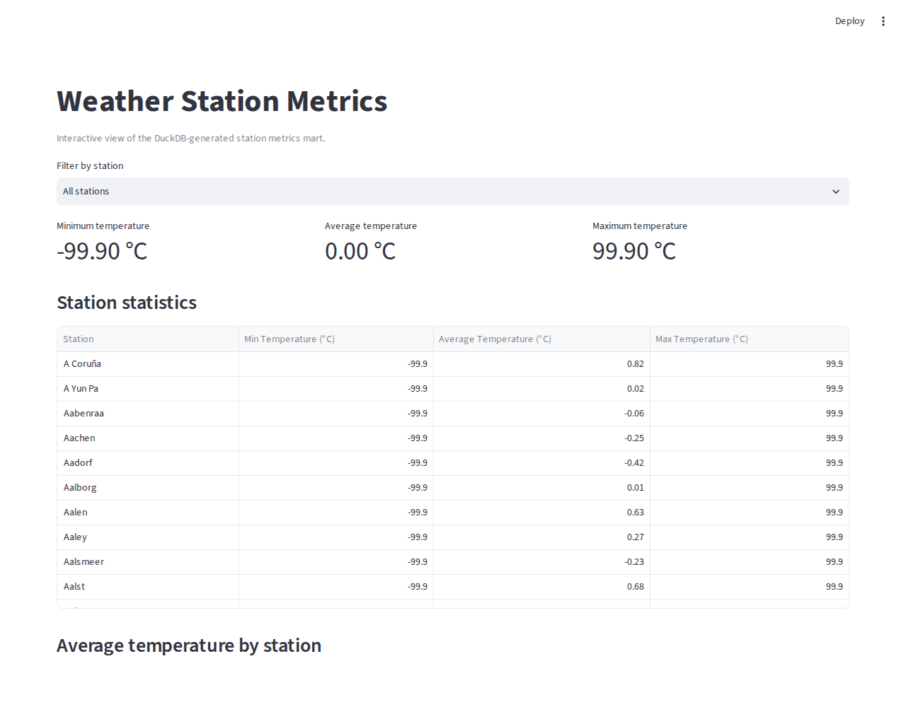

# One Billion Row Challenge in Python


A reproducible data-engineering case study that generates and aggregates a
large synthetic weather-station dataset. The repository keeps several
implementations side by side so that memory use, execution time, and output
formats can be compared across Python, pandas, PyArrow, Polars, and DuckDB.

The project is designed for local experimentation and portfolio review. It is
not a production data platform, and the historical benchmark numbers below
are hardware-specific.

## What the project does

The pipeline has four explicit stages:

1. `create_measurements.py` generates a semicolon-delimited file with one
   `station;temperature` record per line. The generated file has no header, as
   required by the original 1BRC input format.
2. Each implementation in `src/` reads the input and calculates minimum, mean,
   and maximum temperature per station.
3. Every implementation writes a deterministic, alphabetically sorted result
   to CSV and Parquet with the schema `station;min;mean;max`.
4. `src/create_station_metrics_mart.py` renames the result columns for the
   Streamlit dashboard.

Malformed rows and optional headers are ignored by the streaming readers. The
numeric output columns remain numeric in Parquet and are formatted to two
decimal places in CSV.

## Repository layout

```text
.
├── create_measurements.py          # Synthetic input generator
├── data/
│   ├── model.csv                   # Station-name source data
│   └── .gitkeep                    # Generated data is intentionally ignored
├── dashboard/
│   └── app_duckdb_csv_table.py     # Streamlit dashboard
├── src/
│   ├── etl_utils.py                # Shared input, aggregation, and output contract
│   ├── etl_python.py               # Two-pass standard-library approach
│   ├── etl_python_chunking.py      # Bounded chunks with standard-library parsing
│   ├── etl_python_pyarrow.py       # Streaming aggregation + PyArrow output
│   ├── etl_pandas.py               # Full-file pandas approach
│   ├── etl_pandas_chunking.py      # Chunked pandas approach
│   ├── etl_python_polars.py        # Eager Polars approach
│   ├── etl_python_polars_lazy.py   # Lazy/streaming Polars approach
│   ├── etl_duckdb.py               # Out-of-core DuckDB approach
│   └── create_station_metrics_mart.py
├── tests/                          # Small deterministic tests; no 1B-row fixture
└── logs/                           # Runtime CSV logs (ignored by Git)
```

## Requirements and installation

- Python 3.11 (the repository is tested with Python 3.11.x)
- Poetry 2.x, or a regular Python virtual environment
- Enough disk space for the dataset size you choose

With Poetry:

```bash
poetry install
poetry run pytest -q
```

With `venv` and pip:

```bash
python3.11 -m venv .venv
source .venv/bin/activate
python -m pip install --upgrade pip
python -m pip install .
python -m pytest -q
```

The dependency set includes the benchmark engines, PyArrow, Streamlit, and
the development tools used by the repository. Install only the engines you
need when working on a constrained machine.

## Generate input data

Start with a small fixture while learning the pipeline:

```bash
python create_measurements.py 100_000
```

The full challenge input is usually written as:

```bash
python create_measurements.py 1_000_000_000
```

The generator reports an estimated and actual file size. It writes
`data/weather_stations.csv` in bounded batches and uses the station names in
`data/model.csv`. The output is deliberately not committed to Git.

Inspect a generated file with:

```bash
wc -l data/weather_stations.csv
head -n 5 data/weather_stations.csv
```

## Run an implementation

Run commands from the repository root. Every implementation accepts the same
input contract and writes its own output names, so approaches can be compared
without overwriting one another:

```bash
python -m src.etl_python
python -m src.etl_python_chunking
python -m src.etl_python_pyarrow
python -m src.etl_pandas
python -m src.etl_pandas_chunking
python -m src.etl_python_polars
python -m src.etl_python_polars_lazy
python -m src.etl_duckdb
```

The DuckDB implementation is the recommended starting point for a large local
file because it performs an out-of-core SQL aggregation. The other scripts are
valuable comparison points for memory behavior and implementation trade-offs.

Outputs are written beneath `data/`:

| Implementation | CSV | Parquet | Log |
| --- | --- | --- | --- |
| Python two-pass | `measurements_python.csv` | `measurements_python.parquet` | `logs/log_python.csv` |
| Python chunked | `measurements_python_chunk.csv` | `measurements_python_chunk.parquet` | `logs/log_python_chunk.csv` |
| PyArrow | `measurements_pyarrow.csv` | `measurements_pyarrow.parquet` | `logs/log_pyarrow.csv` |
| pandas | `measurements_pandas.csv` | `measurements_pandas.parquet` | `logs/log_pandas.csv` |
| pandas chunked | `measurements_pandas_chunk.csv` | `measurements_pandas_chunk.parquet` | `logs/log_pandas_chunk.csv` |
| Polars | `measurements_polars.csv` | `measurements_polars.parquet` | `logs/log_polars.csv` |
| Polars lazy | `measurements_polars_lazy.csv` | `measurements_polars_lazy.parquet` | `logs/log_polars_lazy.csv` |
| DuckDB | `measurements_duckdb.csv` | `measurements_duckdb.parquet` | `logs/log_duckdb.csv` |

## Dashboard

After running the DuckDB implementation, build the dashboard mart:

```bash
python -m src.create_station_metrics_mart
poetry run streamlit run dashboard/app_duckdb_csv_table.py
```

The dashboard reads `data/station_metrics_mart.csv` and provides:

- station filtering;
- minimum, average, and maximum summary metrics;
- an interactive table;
- bar charts for each metric; and
- a minimum-versus-maximum scatter plot.

It is a local analytical view, not a multi-user serving layer. For a shared
production dashboard, publish the Parquet mart through an appropriate data
service or warehouse.

## Validation and development

The test suite uses temporary, tiny CSV fixtures so it never creates the
one-billion-row dataset. Run all checks with:

```bash
poetry run pytest -q
poetry run python -m compileall -q create_measurements.py src dashboard
poetry run ruff check .
poetry run black --check .
```

The pre-commit configuration includes formatting, basic repository hygiene,
and Ruff hooks. Run the dependency audit separately so it checks the project
environment rather than the hook environment:

```bash
poetry run pre-commit install
poetry run pre-commit run --all-files
poetry run pip-audit
```

## Reproduced in this portfolio session (2026-07-18)

Rather than just carry the historical numbers forward, this repo was re-run end to end on a
different machine: 20 CPUs, 15 GiB of RAM, 4 GiB of swap. The idea was to test whether the
original conclusions actually hold on different hardware, not to assume they do. The full
1,000,000,000-row input was generated again from scratch (14.8 GiB on disk, 324 seconds to write),
and three implementations were re-run against it: DuckDB, PyArrow, and Polars in lazy mode. The
slower stdlib and pandas approaches were left alone this time. Their historical numbers already
took 12 to 24 minutes each on comparable hardware, and re-running them wouldn't have changed
what this reproduction was trying to show.

| Implementation | Result | Source |
| --- | --- | --- |
| **DuckDB** | ✅ **22.73 s**, 41,343 stations | `logs/log_duckdb.csv` |
| **PyArrow** | ✅ **1,185.02 s** (about 19 minutes 45 seconds), 41,343 stations | `logs/log_pyarrow.csv` |
| **Polars (lazy)** | ❌ **Killed by the kernel's out-of-memory handler.** It had climbed to 12.51 GiB of resident memory when that happened. | `journalctl -k` (kernel OOM-killer log) |

Full machine-readable results are in [`docs/evidence/run_results.json`](docs/evidence/run_results.json).

The Polars failure is not a bug anywhere in this repository. It is, in fact, the same outcome the
original historical run already reported for Polars: "did not complete in a 16 GiB environment."
Seeing it happen again independently, on different hardware, with the kernel's own memory-accounting
log as evidence instead of a remembered result, is a stronger form of the same finding. DuckDB
finished the identical workload, on the identical 15 GiB machine, in under 23 seconds.

Why does "lazy" not save Polars here? Lazy evaluation means Polars builds a query plan before running
anything, and in many cases that plan can stream through data in bounded chunks instead of loading it
all at once. But streaming isn't automatic for every operation a plan can contain, and a global
group-by aggregation over 41,343 distinct keys, read from a single large CSV, is exactly the kind of
step that can force the engine to hold much more state in memory than the phrase "lazy" suggests it
should. DuckDB's engine is built around out-of-core execution as a first-class design goal for this
type of workload; Polars' lazy API is a general-purpose query optimizer that happens to support
streaming for some plans, not a guarantee that any given plan will run inside a fixed memory budget.
That distinction is easy to miss until a real run against real hardware makes it obvious.



## Historical benchmark

The following measurements were collected on a Dell OptiPlex homelab with an
Intel Core i5-14500T, 16 GiB RAM, and Ubuntu Server. They are useful for
directional comparison only; operating-system caches, library versions,
storage, CPU settings, and input generation all affect the result. DuckDB and
PyArrow were re-verified on different hardware above; the rows below are
preserved as originally recorded.

| Approach | Result from the recorded run |
| --- | --- |
| Optimized Python | 726.20 s, approximately 1.5 GiB peak RAM |
| Python chunking | 1,436.41 s, approximately 12.2 GiB peak RAM |
| Python + PyArrow output | 711.31 s, approximately 1.2 GiB peak RAM |
| pandas without chunking | Did not complete within the recorded 16 GiB RAM + 4 GiB swap |
| pandas chunking | 348.58 s, approximately 10 GiB peak RAM |
| Polars eager/lazy variants | Did not complete in the recorded 16 GiB environment |
| DuckDB | 12.38 s, approximately 1.76 GiB peak RAM |


The benchmark supports a practical conclusion: DuckDB is a strong local OLAP
engine for this workload, while chunked approaches are useful when a Python
dataframe workflow is required. Neither result replaces measurement on the
target environment.

## Architecture notes

DuckDB is embedded and optimized for analytical workloads. It is a good fit for
batch aggregation, local exploration, and producing a Parquet mart. It is not a
drop-in replacement for a transactional database or a distributed serving
platform. For concurrent applications, authentication, availability,
replication, and horizontal scaling, put an appropriate service or warehouse
in front of the analytical output.

The repository intentionally preserves multiple strategies because the
engineering lesson is not only which tool is fastest. It also covers:

- streaming versus full-file memory profiles;
- numeric output schemas and reproducible sorting;
- malformed-input handling;
- the cost of intermediate files and serialization; and
- the boundary between an experiment, a portfolio case study, and a production
  data product.

## Conclusions

Two runs of this challenge, on two different machines, a year apart, agree on the same thing: for a
single-machine aggregation that doesn't fit comfortably in memory, an engine built around out-of-core
execution beats one that merely tries to be memory-efficient. DuckDB won both times, by a wide margin,
without any tuning beyond calling it the way its own documentation recommends.

That doesn't make DuckDB the right default for everything in this repository, though, and the point of
keeping every implementation side by side is to make that visible instead of hiding it behind a single
winner. PyArrow's streaming approach finished the full billion-row run reliably in about 20 minutes,
with a small and predictable memory footprint. That's a reasonable trade when DuckDB isn't available,
or when the goal is to stay inside plain Python and Arrow's columnar format rather than bring in a full
SQL engine. Plain Python, chunked or not, is slower still, but it's also the version anyone can read
and modify without learning a new library, which has its own value for teaching or for a codebase that
has to stay dependency-light. And Polars, which is a genuinely fast engine in the vast majority of
real workloads, ran into a wall here specifically because this workload was chosen to sit right at
the edge of what fits in 15 to 16 GiB of RAM. Most day-to-day Polars usage never gets close to that
edge, and treating this one result as a verdict on Polars overall would be reading more into it than
the evidence supports.

The more durable lesson is about how to reason before reaching for a tool, not just which one is
fastest today. Ask what the workload actually needs: does it have to fit in memory at all, or can it
spill to disk without much penalty? Is the bottleneck CPU, memory, or I/O? Does the tool's documentation
claim streaming or lazy behavior because it's structurally guaranteed, or because it's usually true for
the common case? Those questions matter more than any leaderboard, and answering them for a specific
piece of hardware, with a real run instead of a specification sheet, is what this repository is set up
to make cheap to do.

## Inspiration and attribution

This project is based on the [One Billion Row Challenge](https://github.com/gunnarmorling/1brc)
and its Python adaptations. The station model data is adapted from
[SimpleMaps world cities](https://simplemaps.com/data/world-cities) under the
license noted in `data/model.csv`.

## License

This project is released under the [MIT License](LICENSE.md).

## Contact

Andre Matiello Caramanti. [matiello.andre@hotmail.com](mailto:matiello.andre@hotmail.com)
